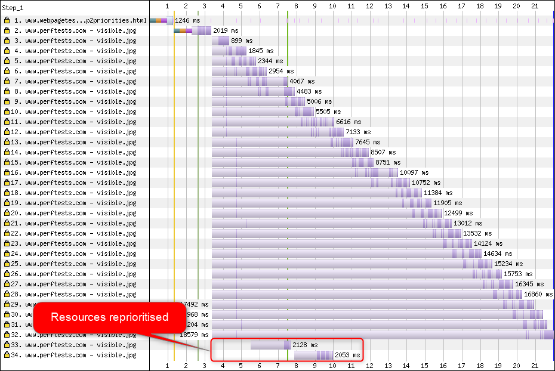
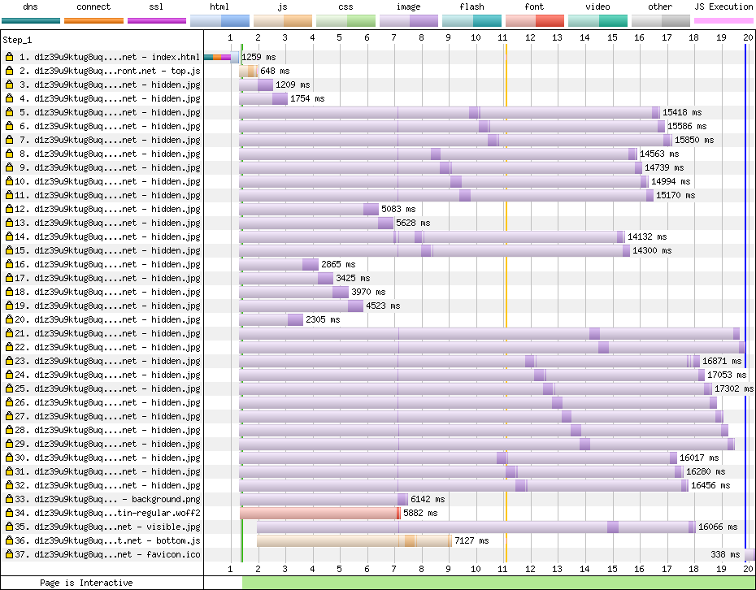
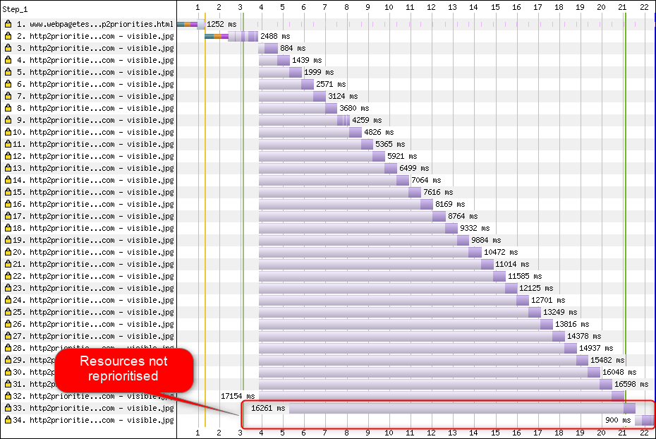

# Tracking HTTP/2 Prioritization Issues

## Introduction

[HTTP/2](https://datatracker.ietf.org/doc/rfc7540/) uses multiplexing to support multiple concurrent requests over the same TCP connection.

HTTP/2 also has a prioritization scheme (via weights & dependencies) that enables browsers to communicate the relative priority of each request.

Unfortunately not all servers are equal – some don't appear to implement prioritization and so serve responses on a 'first come, first served' basis, and others that implement prioritization seem to have a few bugs too – and these issues can create a suboptimal experience for the visitor. This can be a result of the server implementation itself or (more likely) from how it is configured in production.

Browsers implement their priority trees in quite different ways too – if you're interested in digging deeper [@DaanDeMeyer's h2vis](https://github.com/DaanDeMeyer/h2vis) and [WebPageTest](https://www.webpagetest.org/) can visualize these for Chrome and Firefox.

Now [WebPageTest](https://www.webpagetest.org) visualises HEADERS and DATA frames for responses we can get a much clearer picture of how prioritization is implemented across different servers and CDNs.

This repo aims to track and highlight prioritisation issues – if they get fixed then the web become better for all of us. As long as prioritisation is broken there will be significant performance issues with HTTP/2 which isn't good for anybody.

## Getting Started

[@PatMeenan's http2priorities test page](https://github.com/pmeenan/http2priorities/tree/master/stand-alone) is the easiest way to get started – find an appropriate image on your server / host / CDN of choice and then test it using Chrome with [WebPageTest](https://www.webpagetest.org/) using the **"3G Fast"** network profile (do not use 3G, as of Chrome 74 Chrome restricts the number of in-flight requests on low-speed connections). It is recommended that you do a full 9 runs to make sure it consistently passes and is not intermittent.

Pay close attention to requests 33-34, these are high-priority visible images that are loaded after the low-priority images start to load. They have a higher priority so their frames should be re-prioritized ahead of the earlier images.

**CloudFlare - reprioritizes the requests**


**CloudFront - requests are only partially reprioritized**


**Netlify - requests are not reprioritized**


If requests 33-34 don't appear to be prioritised correctly, please raise an issue with the relevant project or vendor.

Visually the difference can be quite dramatic in the filmstrip view:


## Current Status

If you create an issue in this repo with a link to your test (whether good or bad) we'll add it to the table below.

It is important to note that what matters most is whatever the edge is that terminates the HTTP/2 connection from the browser. For example, if you have a CDN in front of a hosting provider (or load balancer) then the CDN will be the thing being tested (and that has the most impact). That also means that you can potentially solve broken prioritisation by putting your site behind a CDN that passes.

### CDNs / Cloud Hosting Services

| CDN / Hosting                      | Status         | Test Result
| ---------------------------------- | -------------- | ----------------------------------------------------------------------------------------------
| Akamai                             | Pass &#9989;   | [Dec 22, 2018](https://www.webpagetest.org/result/181222_MJ_fd74e8439430fe5b18f29da87fd69fb6/)
| Amazon CloudFront                  | FAIL &#10060;  | [Nov 28, 2019](https://www.webpagetest.org/result/191128_E6_8f81ddf9ba2ba82ef814fff7baaa5005/)
| BitGravity                         | FAIL &#10060;  | [Dec 22, 2018](https://www.webpagetest.org/result/181222_XS_7b823220707a4a3b4231a36b4d2c093e/)
| Cachefly                           | FAIL &#10060;  | [Dec 22, 2018](https://www.webpagetest.org/result/181222_FJ_c6a7f6fb45ecf90ce812071663f82409/)
| CDN77                              | FAIL &#10060;* | [Dec 22, 2018](https://www.webpagetest.org/result/181222_QK_71d76ab8e1360fbc6f9cb5c2aa5a43dc/)
| CDNetworks                         | FAIL &#10060;  | [Dec 22, 2018](https://www.webpagetest.org/result/181222_B3_780bec18802592e5869e1784eec84fec/)
| CDNsun                             | Pass &#9989;   | [Dec 22, 2018](https://www.webpagetest.org/result/181222_29_733fd3fa96653a5aac6d13df92d80cbd/)
| ChinaCache                         | FAIL &#10060;  | [Dec 22, 2018](https://www.webpagetest.org/result/181222_5G_b5b88afa1d52329fbb45528ec81d1184/)
| Cloudflare                         | Pass &#9989;   | [Dec 22, 2018](https://www.webpagetest.org/result/181222_7X_2827222a58ea6c1e29163492042a6485/)
| DreamHost                          | Pass &#9989;   | [Dec 22, 2018](https://www.webpagetest.org/result/181222_8M_434a7afb0e4b7e6370d8514088780d19/)
| Edgecast                           | FAIL &#10060;  | [Dec 22, 2018](https://www.webpagetest.org/result/181222_VH_057e3cdecde9fbe6ab207a5e9d6ff4cf/)
| Facebook                           | Pass &#9989;   | [Dec 22, 2018](https://www.webpagetest.org/result/181222_KP_e476988aa243325871f5b311ca36ff41/)
| Fastly                             | Pass &#9989;   | [Dec 22, 2018](https://www.webpagetest.org/result/181222_ZR_ed26f1066e51f9ef689aba928646ebb7/)
| Google Cloud CDN                   | FAIL &#10060;  | [June 12, 2019](https://www.webpagetest.org/result/190612_WA_21ea483d686d259827f7c858aba04ee0/)
| Google Firebase                    | Pass &#9989;   | [Dec 22, 2018](https://www.webpagetest.org/result/181222_2J_672ef37fa5e6839a13690b3aee2827f5/)
| Google Storage                     | FAIL &#10060;  | [Dec 22, 2018](https://www.webpagetest.org/result/181222_0E_9892f5f67fa74c326f383d7986cc0f7b/)
| Highwinds                          | FAIL &#10060;  | [Dec 22, 2018](https://www.webpagetest.org/result/181222_MC_a93fb906376f8fdca8d01506d02c07c1/)
| Incapsula                          | FAIL &#10060;  | [Dec 22, 2018](https://www.webpagetest.org/result/181222_XJ_cb2971fdb79064709a0efcbcd344aedf/)
| Instart Logic                      | FAIL &#10060;  | [Dec 22, 2018](https://www.webpagetest.org/result/181222_FB_948cce8656c4a3e8d9d3de3d25a74893/)
| KeyCDN                             | FAIL &#10060;  | [Dec 22, 2018](https://www.webpagetest.org/result/181222_YW_2db8620b2c0045fbcd23d6f335a648ca/)
| LeaseWeb CDN                       | FAIL &#10060;  | [Dec 22, 2018](https://www.webpagetest.org/result/181222_79_a0de157a0bf55413f4b7c603f1c8c475/)
| Level 3                            | FAIL &#10060;  | [Dec 22, 2018](https://www.webpagetest.org/result/181222_1Y_9d52f3eb45ddf7eff8795dad4fe1285f/)
| Limelight                          | FAIL &#10060;  | [Dec 22, 2018](https://www.webpagetest.org/result/181222_81_8d73f113cc7a8bbde665f73597e25822/)
| Medianova                          | FAIL &#10060;  | [Dec 22, 2018](https://www.webpagetest.org/result/181222_SF_cdeb2e45fa4e14f0f6f328be892f5618/)
| Microsoft Azure                    | FAIL &#10060;  | [Dec 22, 2018](https://www.webpagetest.org/result/181222_HG_306f655f8ae21d42399eefc289666426/)
| Netlify                            | FAIL &#10060;  | [Nov 28, 2019](https://www.webpagetest.org/result/191128_57_d46f21fe3ea067e72a78203bd1e51405/)
| Reflected Networks                 | FAIL &#10060;  | [Dec 22, 2018](https://www.webpagetest.org/result/181222_WW_180c24d9f2f49ace2872be7da9290d4d/)
| Rocket CDN                         | FAIL &#10060;  | [Dec 22, 2018](https://www.webpagetest.org/result/181222_13_0fae55c68ea5bd100b539f2266dd4f0d/)
| section.io                         | Pass &#9989;   | [Jan 1, 2019](https://www.webpagetest.org/result/190117_FF_6f7d90fb39e2614b8850a40f391ceeba/)
| Sucuri Firewall                    | FAIL &#10060;* | [Dec 22, 2018](https://www.webpagetest.org/result/181222_TF_1066ad690da150f7c82b44c070f2425e/)
| StackPath/NetDNA/MaxCDN            | FAIL &#10060;  | [Dec 22, 2018](https://www.webpagetest.org/result/181222_TA_8e1d0e32fa9db6d9622d00941836d4d4/)
| WordPress.com                      | Pass &#9989;   | [Dec 22, 2018](https://www.webpagetest.org/result/181222_C4_8b6b808b7c3f6e8e3ad96e9f6af57902/)
| WordPress.com Jetpack CDN (Photon) | FAIL &#10060;  | [Dec 22, 2018](https://www.webpagetest.org/result/181222_Q7_60c0f336ee9ec40f81f3f606085125e3/)
| Yottaa                             | FAIL &#10060;  | [Dec 22, 2018](https://www.webpagetest.org/result/181222_CN_ad391da7669f125210f192b443d84623/)
| Zenedge                            | FAIL &#10060;  | [Dec 22, 2018](https://www.webpagetest.org/result/181222_04_da222c56d629290bbbcdd2aa91ac384b/)

\* Intermittent Failure

### Load Balancers

This is for cloud or on-premises load balancers (Amazon ALB, Citrix Netscaler, Foundry F5, etc).

| Load Balancer     | Status        | Test Result
| ----------------- | ------------- | ----------------------------------------------------------------------------------------------
| Amazon AWS ALB    | FAIL &#10060; | [Dec 3, 2018](https://www.webpagetest.org/result/181203_PE_654d3b72ba3043836846292c22919e12/)
| Foundry F5        | FAIL &#10060; | [Nov 28, 2019](https://webpagetest.org/result/191128_GN_f5be7638e6f688d1202093cc72a5efe9/)

### Servers

Most servers technically support HTTP/2 prioritisation but are effectively broken when deployed because of buffering in the networking path (within the server, in the TCP stack or in the network itself). Read more about it [here](https://blog.cloudflare.com/http-2-prioritization-with-nginx/).

TODO: Add notes about configuration settings to get prioritisation working for various operating systems and servers.

### Finding Test Images

The [HTTP Archive BigQuery dataset](https://bigquery.cloud.google.com/dataset/httparchive:requests) is particularly useful for finding images for a given CDN or host for testing.

Here is a sample query (warning, each query run can consume close to 1TB of BigQuery quota):

```sql
select
  RTRIM(LTRIM(JSON_EXTRACT(payload, '$._full_url'),"\""),"\"") as url,
  INTEGER(JSON_EXTRACT(payload, '$._bytesIn')) as size
FROM
  [httparchive:requests.2018_12_01_desktop]
WHERE
  RTRIM(LTRIM(JSON_EXTRACT(payload, '$._protocol'),"\""),"\"") = "HTTP/2" AND
  RTRIM(LTRIM(JSON_EXTRACT(payload, '$._contentType'),"\""),"\"") LIKE "image/%" AND
  INTEGER(JSON_EXTRACT(payload, '$._bytesIn')) > 90000 AND
  INTEGER(JSON_EXTRACT(payload, '$._bytesIn')) < 110000 AND
  RTRIM(LTRIM(JSON_EXTRACT(payload, '$._cdn_provider'),"\""),"\"") = "Cloudflare"
LIMIT 20
```