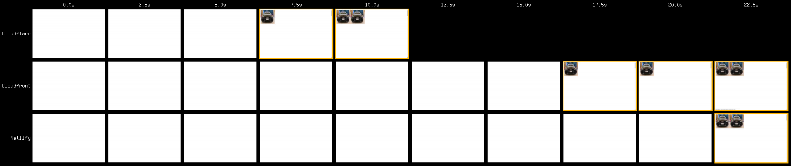

# Tracking HTTP/2 Prioritization Issues

## Introduction

[HTTP/2](https://datatracker.ietf.org/doc/rfc7540/) uses multiplexing to support multiple concurrent requests over the same TCP connection.

HTTP/2 also has a prioritization scheme (via weights & dependencies) that enables browsers to communicate the relative priority of each request.

Unfortunately not all servers are equal – some don't appear to implement prioritization and so serve responses on a 'first come, first served' basis, and others that implement prioritization seem to have a few bugs too – and these issues can create a suboptimal experience for the visitor. This can be a result of the server implementation itself or (more likely) from how it is configured in production.

Browsers implement their priority trees in quite different ways too – if you're interested in digging deeper [@DaanDeMeyer's h2vis](https://github.com/DaanDeMeyer/h2vis) and [WebPageTest](https://www.webpagetest.org/) can visualize these for Chrome and Firefox.

Now [WebPageTest](https://www.webpagetest.org) visualises HEADERS and DATA frames for responses we can get a much clearer picture of how prioritization is implemented across different servers and CDNs.

This repo aims to track and highlight prioritisation issues – if they get fixed then the web become better for all of us. As long as prioritisation is broken there will be significant performance issues with HTTP/2 which isn't good for anybody.

## Getting Started

[@PatMeenan's http2priorities test page](https://github.com/pmeenan/http2priorities) is the easiest way to get started – deploy it on your server / host / CDN of choice and then test it using Chrome with [WebPageTest](https://www.webpagetest.org/) using the 3G network profile. Deploy the page EXACTLY as-is as it is designed to exercise Chrome's prioritisation logic. It is easy to restructure the page to make it load faster but that is not the point of the test, the point is to see how well a server can reprioritise in-flight requests when a higher-priority request comes along. It is also recommended that you do a full 9 runs to make sure it consistently passes and is not intermittent.

Pay close attention to requests 33-36, these are resources that can't be discovered by the pre-parser so their requests start later than the image requests before them, but as they have a higher priority their frames should be re-prioritized ahead of the images.

**CloudFlare - reprioritizes the requests**

**CloudFront - requests are only partially reprioritized**

If requests 33-36 don't appear to be prioritised correctly, please raise an issue with the relevant project or vendor.

Visually the difference can be quite dramatic in the filmstrip view:

## Current Status

If you create an issue in this repo with a link to your test (whether good or bad) we'll add it to the table below.

It is important to note that what matters most is whatever the edge is that terminates the HTTP/2 connection from the browser. For example, if you have a CDN in front of a hosting provider (or load balancer) then the CDN will be the thing being tested (and that has the most impact). That also means that you can potentially solve broken prioritisation by putting your site behind a CDN that passes.

### CDNs / Cloud Hosting Services

| CDN / Hosting           | Status        | Test Result                                                                                    | Tested By 
| ----------------------- | ------------- | ---------------------------------------------------------------------------------------------- | -----------
| Akamai                  | Pass &#9989;  | [Nov 26, 2018](https://www.webpagetest.org/result/181128_WJ_4f388eef1d2e03e513ff74214860d2f0/) | [Stephen Ludin](https://twitter.com/sludin)
| Amazon CloudFront       | FAIL &#10060; | [Nov 26, 2018](https://www.webpagetest.org/result/181126_05_fafd92c1036649029f5392851e0234c2/) | [Andy Davies](https://twitter.com/AndyDavies)
| Cloudflare              | Pass &#9989;  | [Nov 26, 2018](https://www.webpagetest.org/result/181126_G7_3abfb12925925f8debe527c779c46dfe/) | [Patrick Meenan](https://twitter.com/patmeenan)
| Google Firebase         | FAIL &#10060; | [Nov 28, 2018](https://www.webpagetest.org/result/181128_PA_9c3c428698111b81df1cc6eef2e0520c/) | [Patrick Meenan](https://twitter.com/patmeenan)
| Google Storage          | FAIL &#10060; | [Nov 26, 2018](https://www.webpagetest.org/result/181126_XF_361c1789d782990b27a0141e838694bf/) | [Patrick Meenan](https://twitter.com/patmeenan)
| Microsoft Azure         | FAIL &#10060; | [Nov 29, 2018](https://www.webpagetest.org/result/181129_31_90c38d46fe43105554bbcb05dcb25378/) | [Andy Davies](https://twitter.com/AndyDavies)
| Netlify                 | FAIL &#10060; | [Nov 27, 2018](https://www.webpagetest.org/result/181127_79_b033d66f92f6ba47e11b17c06921486a/) | [Patrick Meenan](https://twitter.com/patmeenan)
| StackPath/NetDNA/MaxCDN | FAIL &#10060; | [Nov 30, 2018](https://www.webpagetest.org/result/181130_X6_5b0ee849de726e1a425fcfec9f3caf5f/) | [Patrick Meenan](https://twitter.com/patmeenan)

### Load Balancers

This is for cloud or on-premises load balancers (Amazon ELB, Citrix Netscaler, Foundry F5, etc).

| Load Balancer     | Status        | Test Result                                                                                    | Tested By 
| ----------------- | ------------- | ---------------------------------------------------------------------------------------------- | -----------

### Servers

Most servers technically support HTTP/2 prioritisation but are effectively broken when deployed because of buffering in the networking path (within the server, in the TCP stack or in the network itself). Read more about it [here](https://blog.cloudflare.com/http-2-prioritization-with-nginx/).

TODO: Add notes about configuration settings to get prioritisation working for various operating systems and servers.