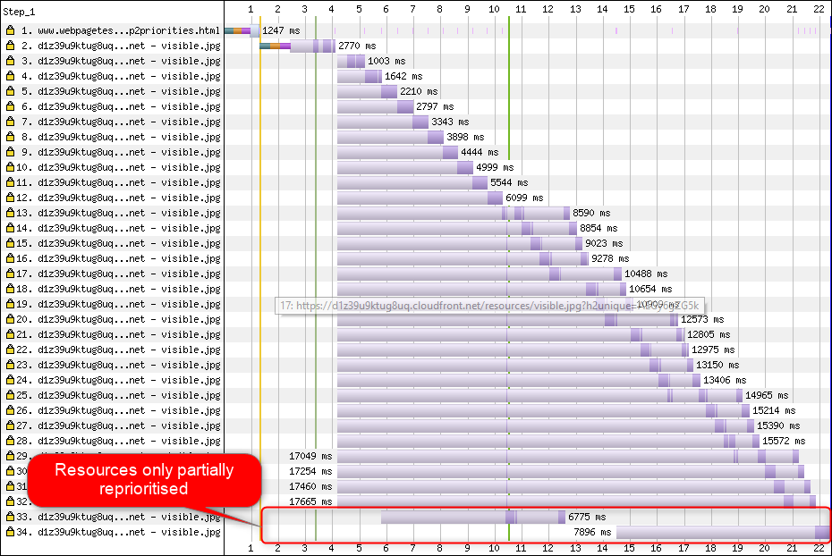

# Tracking HTTP/2 Prioritization Issues

## Introduction

[HTTP/2](https://datatracker.ietf.org/doc/rfc7540/) uses multiplexing to support multiple concurrent requests over the same TCP connection.

H2 also has a prioritization scheme (via weights & dependencies) that enables browsers to communicate the relative priority of each request.

Unfortunately not all servers are equal – some don't appear to implement prioritization and so serve responses on a  'first come, first served' basis, and others that implement prioritization seem to have a few bugs too – and these issues can create a suboptimal experience for the visitor.

Browsers implement their priority trees in quite different ways too – if you're interested in digging deeper [@DaanDeMeyer's h2vis](https://github.com/DaanDeMeyer/h2vis) can visualize these for Chrome and Firefox

Now [WebPageTest](https://www.webpagetest.org) visualises HEADERS and DATA frames for responses we can get a much clearer picture of how prioritization is implemented across different servers and CDNs.

This repo aims to track and highlight prioritisation issues – if they get fixed then the web become better for all of us.

## Getting Started

[@PatMeenan's http2priorities test page](https://github.com/pmeenan/http2priorities) is the easiest way to get started – deploy it on your server / host / CDN of choice and then test it using Chrome / Firefox / Edge / Safari using WebPageTest using the 3G network profile.

Pay close attention to requests 33-36, these are resources that can't be discovered by the pre-parser so their requests start later than the image requests before them, but as they have a higher priority their frames should be re-prioritized ahead of the images.

**CloudFlare - reprioritizes the requests**

**CloudFront - requests are only partially reprioritized**

If requests 33-36 don't appear to be prioritised correctly, please raise an issue with the relevant project or vendor.

If you create an issue in this repo with a link to your test (whether good or bad) we'll add it to the table below.

## Current Status

TODO(AD) add table of know tests here servers / CDNs as rows, browsers as columns???

